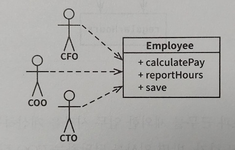
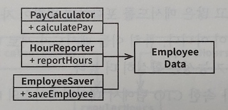
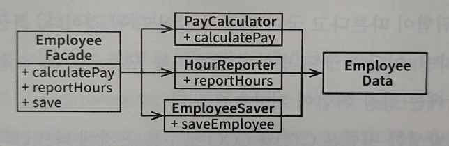
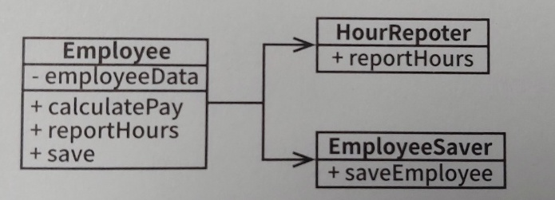

# SRP(Single Responsibility Principle)

## 원칙

SRP의 원칙은 단일 모듈의 변경의 이유가 오직 하나뿐이어야 함을 말한다. 
소프트웨어 시스템은 결국 액터를 만족시키기 위해 변경된다. 액터란 변경을 요청하는 한 명 이상의 사람(사용자나 이해관계자)들을 의미하는데, SRP가 말하는 '변경의 이유'란 바로 이들 액터를 가리킨다.  
그러므로 이 원칙은 결국 **하나의 모듈이 오직 하나의 액터에 대해서만 책임져야 한다**는 것을 의미한다.

## 모듈

모듈의 가장 단순한 정의는 소스 파일이다. 하지만 일부 언어나 개발환경은 코드를 소스 파일로 저장하지 않는데, 이런 경우 모듈은 단순히 함수와 데이터 구조로 구성된 응집된 집합이다. 
그래서 단일 액터를 책임지는 코드를 함께 묶어주는 응집성이 SRP 원칙의 필수조건이다.

## SRP를 위반하는 징후들

### 문제가 되는 클래스의 예

위 Employee 클래스는 세 명의 액터를 책임지고 있음.

* calculatePay() : 회계팀에서 기능을 정의, CFO 보고를 위해 사용.
* reportHours() : 인사팀에서 기능을 정의, COO 보고를 위해 사용.
* save() : DBA가 기능을 정의, CTO 보고를 위해 사용.

### 1. 우발적 중복

calculatePay() 메서드와 reportHours() 메서드가 초과 근무를 제외한 업무 시간을 계산하는 알고리즘인 regularHours() 메서드를 공유하고 있다고 가정한다. 
이 때, CFO 팀에서 계산하는 방식을 변경하고자 하고, 개발자는 요청사항을 적용해서 테스트후에 배포하게 된다. 
COO팀은 이 사실을 알지 못하며, 잘못된 보고서가 만들어지고 예산이 초과 지출되었다는 결과를 알게 되어서야 이 사실을 인지하게 된다.

### 2. 병합

CTO 팀에서 Employee 테이블의 스키마 변경과 COO 팀에서 reportHours() 메서드의 보고서 포맷을 변경하기로 했다고 가정한다. 
두 명의 서로 다른 개발자가 체크아웃 받아서 작업하게 되고, 변경사항은 충돌하게 되어 병합이 발생하게 될 것이다. 그리고 이 병합을 해결하더라도 완벽하리라는 보장이 없다.

### 해결책

#### 데이터와 메서드를 분리

* 메서드가 없고 데이터만 있는 EmployeeData 클래스를 생성하고 세 개의 클래스가 공유.
* 각 클래스는 자신의 메서드에 반드시 필요한 소스 코드만을 포함.
* 세 클래스는 서로의 존재를 모름.

#### 보완 1 : 퍼사드 패턴

* 세 가지 클래스를 인스턴스화하고 추적해야 하는 단점 극복.
* EmployeeFacade는 세 클래스의 객체를 생성하고 메서드의 실행을 각 객체로 위임.

#### 보완 2 : 가장 중요한 업무 규칙을 데이터와 가깝게 배치

* 가장 중요한 메서드는 기존의 Employee 클래스에 그대로 유지.
* 덜 중요한 나머지 메서드들에 대해 퍼사드로 사용.