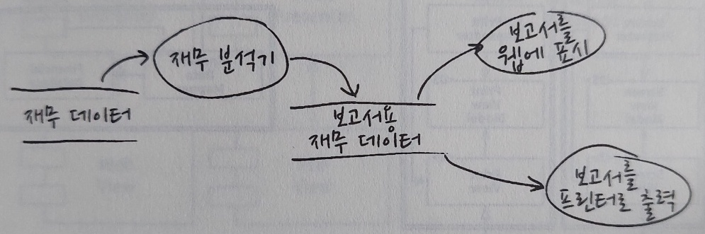
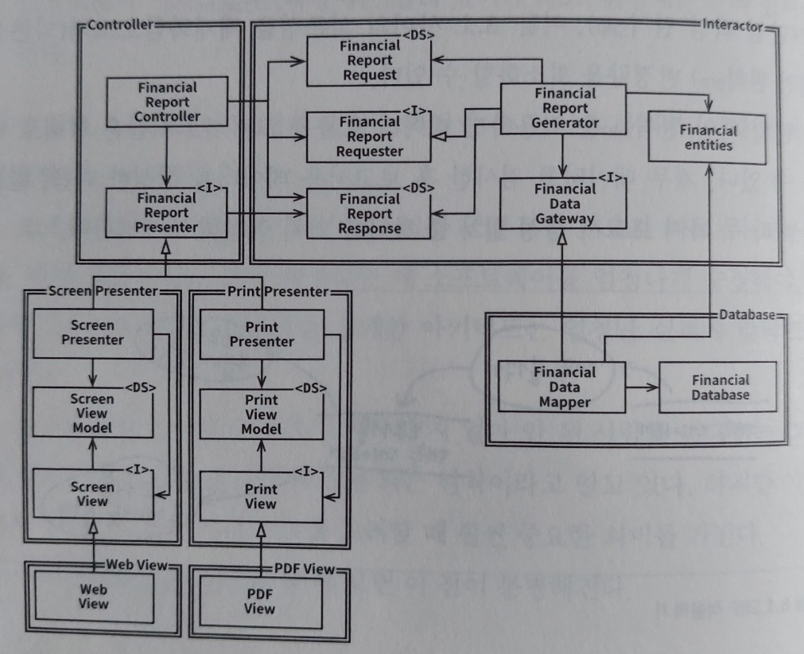
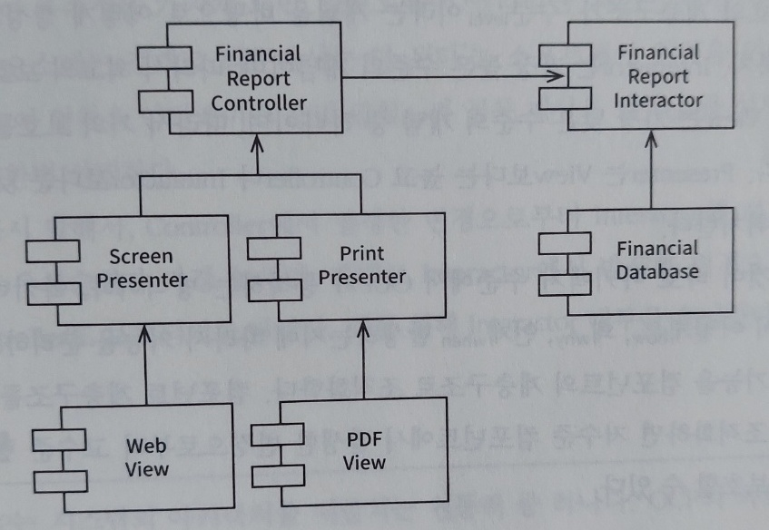

# OCP(Open-Closed Principle, 개방 폐쇄 원칙)

## 원칙

COP의 원칙은 소프트웨어 개체는 확장에는 열려 있어야 하고, 변경에는 닫혀 있어야함을 말한다. 
즉, 소프트웨어 개체의 행위는 확장할 수 있어야 하지만, 이 때 변경해서는 안 된다. 만약 요구사항을 살짝 확장하는데 소프트웨어를 엄청나게 수정해야 한다면, 그 아키텍처는 실패한 것이다.

## 예제

재무제표를 웹 페이지로 보여주는 시스템이 있고, 이해관계자가 동일 정보를 프린터로 출력해 달라고 요청했다고 가정한다. 

### SRP 적용

만약 SRP를 지켜서 서로 다른 목적으로 변경되는 요소를 분리했다면 변경되는 코드의 양은 최소화될 것이다.

SRP를 지켜서 보고서 생성은 두 개의 책임으로 분리되었다. 

### 소스 코드 의존성 조직화

두 책임 중 한 곳에서 변경이 발생하더라도 다른 하나는 변경되지 않도록 소스 코드 의존성도 조직화해야 한다. 또한, 새로 조직화한 구조에서는 행위가 확장될 때 변경이 발생하지 않음을 보장해야 한다. 
그러기위해 처리 과정을 클래스 단위로 분할하고, 클래스를 컴포넌트 단위로 구분해야 한다.

* 컴포넌트 구성요소
    * &lt;I&gt; : 인터페이스
    * &lt;DS&gt; : 데이터 구조
    * 열린 화살표 : 사용(using) 관계
    * 닫힌 화살표 : 구현 또는 상속 관계

#### 포인트 1 : 소스 코드 의존성

여기서 모든 의존성은 소스 코드 의존성을 나타낸다. 예를 들어, FinancialDataMapper는 구현 관계로 FinancialDataGateway를 알고 있지만, FinancialDataGateway는 FinancialDataMapperd에 대해 알지 못한다. 
만약 FinancialDataGateway가 없었다면, 의존성이 Interactor 컴포넌트에서 Database 컴포넌트로 바로 향하게 된다. 

#### 포인트 2 : 모든 컴포넌트 관계는 단 방향으로 이루어짐

컴포넌트의 관계는 화살표가 오직 한 방향으로만 이루어져 있는데, 이는 변경으로부터 보호하려는 컴포넌트를 향하도록 그려진다. 
위 그림에서는 Presenter는 View로부터, Controller는 Presenter로부터, Interactor는 다른 모든 것으로 부터 보호하고자 한다. 
이 것은 보호의 계층구조를 나타내기도 하는데, Interactor는 가장 높은 수준의 개념(업무 규칙)이며, 최고의 보호를 받게 된다. 그래서 Interactor는 OCP를 가장 잘 준수할 수 있는 곳에 위치해야 한다. 그리고 View는 가장 낮은 수준의 개념 중 하나이며 거의 보호를 받지 못하게 된다.

#### 포인트 3 : 추이 종속성

만약 FinancialReportRequester가 없다면 Controller는 FinalcialEntities에 대해 추이 종속성을 가지게 된다. 
그럼 소프트웨어 엔티티는 '자신이 직접 사용하지 않는 요소에 절대로 의존해서는 안 된다'는 소프트웨어 원칙을 위반하게 된다. 
그래서 Controller에서 발생한 변경으로부터 Interactor를 보호하는 것도 있지만, 반대로 Interactor에서 발생한 변경으로부터 Controller를 보호하는 목적도 있기 때문에 해당 인터페이스를 통해 Interactor 내부를 은닉한다.

* 추이 종속성 : 클래스 A가 B에 의존하고, 다시 B가 C에 의존하면, A는 C에 의존하게 된다.

### 정리

아키텍트는 기능이 어떻게, 왜, 언제 발생하는지에 따라 기능을 분리하고 컴포넌트의 계층구조로 조직화한다. 이렇게하면 저수준의 컴포넌트에서 발생한 변경으로부터 고수준의 컴포넌트를 보호할 수 있어야 한다.

## 결론

OCP의 목표를 달성하기 위해 시스템을 컴포넌트 단위로 분리하고, 저수준 컴포넌트에서 발생한 변경으로부터 고수준 컴포넌트를 보호할 수 있는 의존성 계층구조가 만들어지도록 해야 한다.

