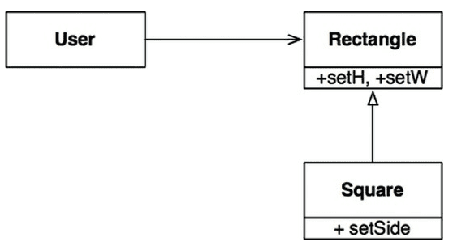

# LSP(Liskov Substiution Principle, 리스코프 치환 원칙)

## 원칙 

LSP는 상위 타입을 하위 타입으로 치환할 수 있어야 한다는 원칙이다.

### 하위 타입

프로그램 P에서 이용하는 T 타입 객체의 모든 자리에 S 타입의 객체로 치환하더라도 P의 행위가 변하지 않는다면, S는 T의 하위 타입이라고 할 수 있다.

### 상속

LSP는 올바르게 상속을 사용하도록 요구하고 있는데, LSP를 준수한다면 다형성이 성립 되어서 상위 타입을 사용하는곳에서는 실제 구현체가 어떤 하위 타입인지에 의존하지 않게 된다. 그리고 이들 하위 타입은 모두 상위 타입의 자리로 치환할 수도 있게 된다.<br/>
LSP를 준수하지 못한다는 것은 잘못된 상속과 다형성을 사용하고 있다는 것이므로 결국 OCP도 준수하지 못하게 된다. 

## 대표적인 위반 사례

대표적인 예로 정사각형(Square)/직사각형(Rectangle) 문제가 있다.



Rectangl의 높이와 너비는 서로 독립적으로 변경이 가능하지만, Square의 높이와 너비는 함께 변경되기 때문에 LSP가 성립되지 않는다.

```java
Rectangle r = new Square();
r.setW(5);
r.setH(2);
assert(r.area() == 10);
```

위의 코드를 실행하면 실패하게 된다. 실패를 막기 위해선 타입을 체크해야 하는데, 이렇게 되면 클라이언트의 행위가 사용하는 타입에 의존하게 되기 때문에 결국 타입을 서로 치환할 수 없게 된다.

## 아키텍처

LSP는 단순히 상속을 올바르게 사용하도록 가이드하는 정도였지만, 시간이 지날수록 인터페이스와 구현체에 적용되는 더 광범위한 소프트웨어 설계 원칙으로 변모해왔다.<br/>

* 인터페이스의 다양한 형태의 예
    * 자바 : 인터페이스 하나와 이를 구현한 여러 개의 클래스.
    * 루비 : 동일한 메서드 시그니처를 공유하는 여러 개의 클래스.
    * REST : 동일한 REST 인터페이스에 응답하는 서비스 집단.

결국 LSP는 잘 정의된 인터페이스와 그 인터페이스의 구현체끼리의 상호 치환이 가능한 모든 경우에 대한 것으로 의미가 확장되었다.

## LSP 위배 사례(REST 인터페이스)

### 예제 시스템

* 다양한 택시 파견업체의 서비스를 통합하는 애플리케이션이 존재.
* 고객이 택시를 결정하면, 시스템은 REST API 서비스로 택시를 고객 위치로 파견.

### 아키텍처

* 택시 파견 REST 서비스의 URI가 운전기사 DB에 저장되어 있음.
    * 예를 들어 purplecab에서 일하는 택시기사 Bob의 uri는 purplecab.com/driver/Bob
* 해당 기사의 URI 정보를 얻고, 그 정보를 이용해서 해당 기사를 고객 위치로 파견.
    * URI에 파견에 필요한 정보를 덧붙여서 PUT 방식으로 호출.
    * purplecab.com/driver/Bob/pickupAddress/../pickupTime/../destination/..

### LSP 위반

* 택시업체 ACME 사가 REST 서비스 사양서를 제대로 읽지 않고 destination을 det로 축약.
* 이 업체에게 변경 요청을 할 수 없는 상황.
* ACME 사에 대한 분기문을 작성하던, 택시업체별로 uri 포맷을 따로 DB에 저장하는 등 방법을 강구해야 함.
* 또한 REST 서비스들의 인터페이스가 서로 치환이 가능하지 않다는 사실을 처리하는 중요하고 복잡한 매커니즘을 추가해야 함.

## 결론

LSP는 코드 수준에서 아키텍처 수준까지 확장되었고, 치환 가능성을 조금이라도 위배하면 시스템 아키텍처가 오염되어 별도의 매커니즘을 추가해야 할 수도 있다.


