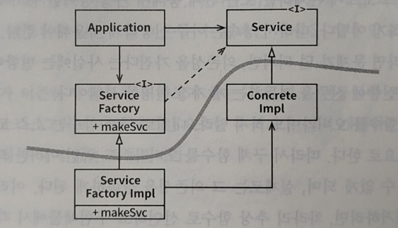

# DIP(Dependency Inversion Principle, 의존성 역전 원칙)

## 원칙

DIP는 소스 코드 의존성이 추상(abstraction)에 의존하고 구체(concretion)에는 의존하지 않는 것을 말한다. 유연성이 극대화된 시스템을 만드는것이 이 원칙의 목표이다.

## DIP의 대상

현실적으로 소프트웨어 시스템은 구체적인 장치에 반드시 의존해야만 하는 경우도 많이 있다. 그 예로 자바의 String 클래스가 있는데, 변경에 대해 엄격히 관리되기 때문에 그대로 사용해도 크게 염려할 필요는 없다. 
이처럼 안정성이 보장된 것에 대해서는 DIP를 무시하는 편이며, DIP는 변동성이 큰 구체적인 요소에 대해서만 의존성을 피하고자 한다. 
이 변동성이 큰 구체적인 요소는 개발자들이 열심히 개발중인 모듈들(자주 변경될 수밖에 없는), 특히 비즈니스 로직이 크게 해당될 것이다.

## 안정된 추상화

안정된 소프트웨어 아키텍처는 변동성이 큰 구현체가 아닌 안정된 추상 인터페이스에 의존하는 아키텍처이다. 추상 인터페이스는 구현체보다 변동성이 낮기 때문이다.

### 안정된 아키텍처를 위한 코딩 실천법

* 변동성이 큰 구체 클래스를 참조하지 않는다.
    * 추상 인터페이스를 참조.
    * 객체 생성 방식을 강하게 제약, 추상 팩토리 사용 권장.
* 변동성이 큰 구체 클래스로부터 파생하지 않는다.
    * 상속은 강력한 기능이지만 뻣뻣해서 변경하기 어렵기 때문에 신중히 사용.
* 구체 함수를 오버라이드 하지 않는다.
    * 구체 함수의 소스 코드에 의존성을 갖게 되기 때문에 추상 함수로 선언하고 구현체에서 용도에 맞게 구현.
* 구체적이며 변동성이 크다면 절대로 그 이름을 언급하지 않는다.

## 추상 팩토리

변동성이 큰 구체적인 객체는 특별히 주의해서 생성해야 한다. 객체 생성은 객체를 구체적으로 정의한 코드에 대해 소스 코드 의존성이 발생하기 때문인데, 이럴 경우 보통 추상 팩토리를 사용한다.

    
* Service 인터페이스를 통해 ConcreteImpl을 사용.
* ConcreteImpl 생성을 위해 ServiceFactory 인터페이스의 makeSvc 메서드 사용.
* makeSvc는 ServiceFactory의 구현체인 ServiceFactoryImpl에서 구현.

### 아키텍처의 경계

위 그림의 곡선은 아키텍처의 경계를 나타내는데, 여러 가지 의미를 내포하고 있다.

#### 1. 소스 코드 의존성

곡선은 소스 코드 의존성이 추상적인 쪽으로 향하고 있음을 보여준다.

#### 2. 컴포넌트 분리

곡선은 추상 컴포넌트와 구체 컴포넌트를 분리하며, 추상 컴포넌트는 고수준 업무 규칙을 구체 컴포넌트는 업무 규칙을 다루기 위해 필요한 모든 세부사항을 포함한다.

#### 3. 제어흐름

제어흐름이 소스 코드 의존성과 정반대 방향으로 곡선을 가로지르고 있음을 보여준다. 즉, 소스 코드 의존성이 제어흐름과 반대 방향으로 역전(DIP)된다.

### 구체 컴포넌트

DIP 위배를 모두 없앨수는 없으며, 그림에서도 ServiceFactoryImpl 구체 클래스가 ConcreteImpl 구체 클래스에 의존한다. 
하지만 이런 클래스들은 적은 수의 구체 컴포넌트 내부로 모을 수 있으며, 시스템의 나머지 부분과 분리할 수 있다. 대다수의 시스템은 이런 구체 컴포넌트를 최소한 하나는 포함할 것이다.