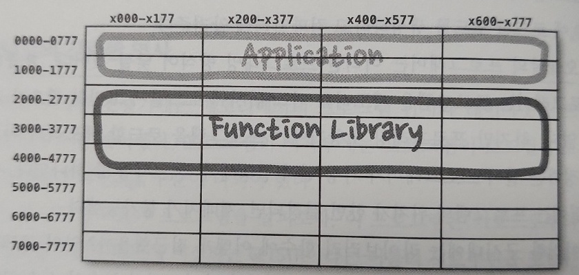
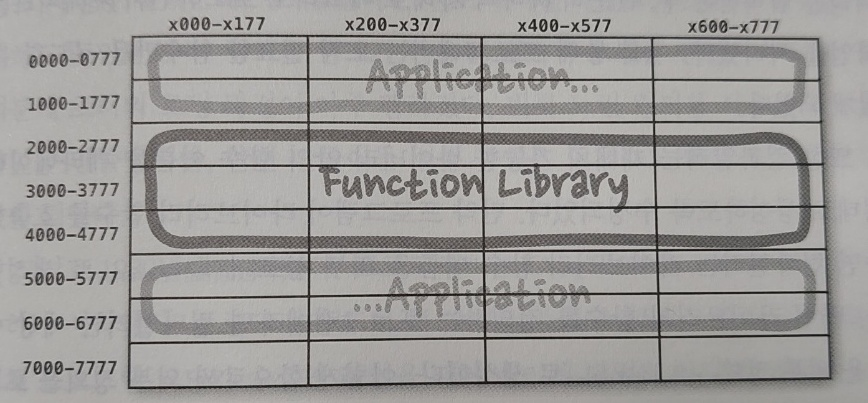

# 컴포넌트

컴포넌트는 시스템의 구성 요소로 배포할 수 있는 가장 작은 단위, 즉 배포 단위이다. 잘 설계된 컴포넌트라면 독립적으로 배포 가능한(독립적으로 개발 가능한) 능력을 갖춰야 한다.

### 베포 단위 예

모든 언어에서 컴포넌트는 배포할 수 있는 단위 입자다.

* 각 프로그래밍 언어 : jar(자바), gem(루비), DLL(닷넷) 등
* 컴파일형 언어 : 바이너리 파일의 결합체
* 인터프리터형 언어 : 소스 파일의 결합체

### 여러 컴포넌트의 묶음

여러 컴포넌트를 묶어 실행 가능한 단일 파일로 생성할 수 있으며, 예로 .war 파일이 있다.

## 컴포넌트의 간략한 역사

### 애플리케이션의 메모리 주소 지정

현재는 프로그래머가 프로그램을 메모리의 어느 주소에 로드할지 고민할 필요가 없지만, 프로그래밍 초창기에는 프로그램을 로드할 메모리의 위치를 정하는 일이 프로그래머가 가장 먼저 결정해야 하는 사항 중 하나였다. 

### 라이브러리 컴파일

라이브러리를 사용해야하는 경우엔 라이브러리 소스 코드를 애플리케이션 코드에 직접 포함시켜서 단일 프로그램으로 컴파일했다. 그러나 이 시대는 하드웨어의 자원이 한정적이었기 떄문에 컴파일러는 소스 코드 전체를 여러 번 읽어야 했고, 소스 코드 전체를 메모리에 상주시킬 수도 없었다. 
그래서 라이브러리가 클수록 컴파일은 오래걸렸고, 대규모 프로그램은 컴파일하는데 몇 시간씩 걸리곤 했다. 
결국 컴파일 시간을 단축하기 위해 라이브러리를 개별적으로 컴파일하고 메모리의 특정 위치에 로드하는 방법을 사용했다.

#### ※ 코어 메모리

과거에는 컴퓨터 전원이 꺼져도 데이터가 삭제되지 않는 코어 메모리를 사용했으며, 한 번 메모리에 로드해두면 며칠 동안 그대로 사용했다.

### 애플리케이션과 라이브러리를 각각 메모리 로드

* 애플리케이션은 0000과 1777 사이의 주소 공간에 로드.
* 라이브러리는 2000과 2777 사이의 주소 공간에 로드.

이 경우 처음엔 잘 동작하겠지만, 애플리케이션이 커지면서 할당 범위를 넘어서게 되고 주소 세그먼트를 분리하여 배치하게 된다.

* 라이브러리를 공간을 사이에 두고 애플리케이션을 나눠서 배치.

만약 라이브러리마저 할당 범위를 넘어서게 되면 똑같이 주소를 나눠서 배치하게되고 이런일이 반복되면 단편화가 이루어지면서 메모리 낭비로 이어질 수밖에 없는 구조였다.

### 재배치

단편화 문제를 해결하기 위해 지능적인 로더를 사용해서 메모리에 재배치할 수 있는 형태의 바이너리를 생성하도록 컴파일러를 수정하고자 했다. 그래서 라이브러리와 애플리케이션을 로드할 위치를 로더에게 지시할 수 있게 되었다.

### 링킹 로더

컴파일러는 재배치 가능한 바이너리 안의 함수 이름을 메타데이터 형태로 생성하도록 수정되기도 했다.

1. 외부 참조 : 프로그램이 호출하는 라이브러리 함수 이름을 외부 참조로 생성.
2. 외부 정의 : 라이브러리 함수를 정의하는 프로그램 이름을 외부 정의로 생성.

외부 정의를 로드할 위치가 정해지면 로더가 외부 참조를 외부 정의에 링크시킬 수 있게 된다. 이렇게 프로그램을 로드하는 동시에 링크까지 수행하는 로더인 링킹 로더가 탄생했다.

### 링킹 로더의 한계

링킹 로더의 등장으로 프로그램을 개별적으로 컴파일하고 로드할 수 있는 단위로 분할할 수 있게 되었다. 하지만 프로그램이 훨씬 더 커지게 되면서 링킹 로더가 너무 느려지게 되는 경우가 발생했다. 
속도가 느린 디스크 장치에서 수십, 수백 개의 바이너리 라이브러리를 읽고 외부 참조를 해석해야 했는데, 프로그램 하나를 로드라는 것도 한 시간 이상이 걸리게 되었다.

### 링커

링킹 로더가 느려지는 현상을 극복하기 위해 로드와 링크가 두 단계로 분리가 되었으며, 링커라는 별도의 애플리케이션으로 링크 작업을 처리하도록 했다. 링커는 링크가 완료된 재배치 코드를 만들어 주었고, 느리긴하지만 링커를 사용해서 실행 파일을 한 번 만들어두면 언제라도 빠르게 로드할 수 있게 되었다.

### 컴파일-링크 병목

하지만 프로그램의 크기가 더욱 더 커지게 되었고(기본 수십만 라인의 코드), 컴파일과 링커에서 많은 시간이 소요되어 컴파일-링크 시간의 병목 구간이 발생하게 되었다.

### 하드웨어의 발전으로 인한 해결

프로그래머는 처리 과정을 더 빠르게 만들기 위해 노력했지만 소용이 없었다. 하지만 무어의 법칙으로 하드웨어는 점차 작아지고 빨라지기 시작했으며, 프로그래머들이 고민하고 해결하려고 했던 문제들이 자연스럽게 해결되었다. 즉, 프로그래머가 프로그램을 성장시키는 속도보다 링크시간이 줄어드는 속도가 더 빨라지기 시작한 것이다.

### 플러그인 아키텍처

하드웨어의 발전으로 또다시 로드와 링크를 동시에 사용할 수 있게 되었고, 다수의 라이브러리를 순식간에 서로 링크한 후 실행할 수 있게 되었다. 즉, 공유 라이브러리의 시대가 열리에 된 것이며, 컴포넌트 플러그인 아키텍처가 탄생하게 된 것이다. 오늘날에는 jar파일이나 DLL, 라이브러리를 기존 애플리케이션에 플러그인 형태로 배포하는 것이 일상적인 일이 되었다.

## 결론

결국 여기서 설명하는 소프트웨어 컴포넌트란, 런타임에 플러그인 형태로 결합할 수 있는 동적 링크 파일이다.
