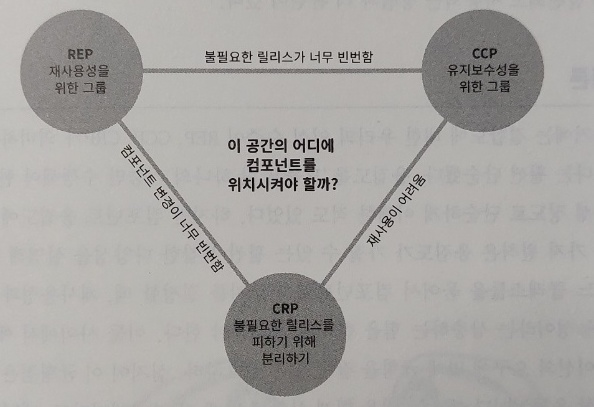

# 컴포넌트 응집도

어떤 클래스를 어느 컴포넌트에 포함시켜야 할지 결정하는 것은 아주 중요하다. 이런 고민에 도움을 줄 컴포넌트 응집도와 관련된 세 가지 원칙이 존재한다.

## REP(Reuse/Release Equivalence Principle, 재사용/릴리스 등가 원칙)

이 원칙은 재사용 단위는 릴리스 단위와 같다고 말한다. 지난 10년 간 모듈 관리 도구와 라이브러리가 많이 만들어지면서 소프트웨어 재사용의 시대가 열리게 되었으며, 그에 따라 소프트웨어 컴포넌트가 릴리스 절차에 의해 추적 관리되고 릴리스 번호가 부여되는 것이 중요해졌다. 
만약 그렇지 않다면 재사용 컴포넌트들이 서로 호환되는지 보증할 수 없고, 개발자들은 새로운 버전에 어떤 변화가 있는지 알 수 없어서 기존 버전을 계속 사용할지 교체할지 판단할 수 없다.

### 아키텍처 관점

이 원칙을 아키텍처 관점에서 보면 단일 컴포넌트는 응집성 높은 클래스와 모듈들로 구성되어야 함을 의미한다. 또한 이것은 하나의 컴포넌트로 묶인 클래스와 모듈은 반드시 함께 릴리스가 가능해 함을 의미하기도 한다. 즉, 하나의 컴포넌트로 묶인 클래스와 모듈은 버전 번호가 같아야 하며, 동일한 릴리스로 추적 관리되고, 동일한 릴리스 문서에 포함되어야 한다.

## CCP(Common Closure Principle, 공통 폐쇄 원칙)

SRP를 컴포넌트 관점에서 적용한 원칙으로, 단일 컴포넌트는 변경의 이유가 하나여야 함을 의미한다. 물리적으로나 개념적으로 강하게 결합되어 항상 함께 변경되는 클래스들을 하나의 컴포넌트로 모으면 릴리스, 재검증, 배포하는 작업을 최소화할 수 있기 때문이다. 

### OCP와의 연관성

CCP에서 말하는 폐쇄는 OCP의 폐쇄와 같다. OCP는 클래스의 변경에는 닫혀 있고 확장에는 열려 있어야한다고 말하는데, CCP에서는 동일한 유형의 변경에 대해 닫혀 있는 클래스들을 하나의 컴포넌트로 묶음으로써 OCP에서 얻은 교훈을 확대 적용한다. 
그렇게되면 변경 요구사항이 발생했을 때, 그 변경이 영향을 미치는 컴포넌트의 수는 최소한으로 한정될 가능성이 높아진다.

## CRP(Common Reuse Principle, 공통 재사용 원칙)

CRP도 같이 재사용되는 경향이 있는 클래스와 모듈들은 같은 컴포넌트에 포함해야 한다고 말한다. 그리고 또한 동일한 컴포넌트로 묶어서는 안되는 클래스가 무엇인지도 말해준다.

### 클래스의 분리

어떤 컴포넌트가 다른 컴포넌트를 사용하면 두 컴포넌트 사이에 의존성이 생기게 되는데, 이 때 단 하나의 클래스만 사용할 수도 있다. 그렇다고 의존성이 약해지지 않으며, 사용되는 컴포넌트가 변경될 떄마다 사용하는 컴포넌트도 변경해야 할 가능성이 높다. 
한 컴포넌트에 속한 클래스들을 더 작게 그룹지을 수는 없기 때문에 일부 클래스에만 의존하고 다른 클래스와는 독립적일 수 없음을 확실히 인지해야 한다. 따라서 CRP는 강하게 결합되지 않은 클래스들을 동일한 컴포넌트에 위치시켜서는 안 된다고 말한다.

### ISP와의 관계

CRP는 ISP 원칙의 포괄적인 버전으로, 사용하지 않는 클래스를 가진 컴포넌트에 의존하지 말라고 조언한다. 즉, 필요하지 않은 것에 의존하지 말라는 것을 의미한다.

## 컴포넌트 응집도에 대한 균형 다이어그램

응집도에 대한 세 원칙은 서로 상충된다. REP와 CCP는 포함 원칙으로서 컴포넌트를 크게 만들지만, CRP는 배제 원칙으로 컴포넌트를 작게 만든다. 그래서 이 원칙들이 균형을 이루는 방법을 찾아야 한다.

* 각 변은 반대쪽 꼭지점에 있는 원칙을 포기했을 때 감수해야 할 비용을 나타냄.
* 보통 프로젝트는 삼각형의 오른쪽에서 시작, 시간이 지날수록 왼쪽으로 이동해 감.
    * 프로젝트의 컴포넌트 구조는 시간과 성숙도에 따라 변해감.

## 결론

어느 클래스들을 묶어서 컴포넌트로 만들지를 결정할 때, 재사용성과 개발가능성이라는 상충하는 힘을 반드시 고려해야 한다. 이들 사이에서 애플리케이션의 요구에 맞는 균현을 잡는 일은 중요하며, 이 균형점은 거의 항상 유동적이다.
