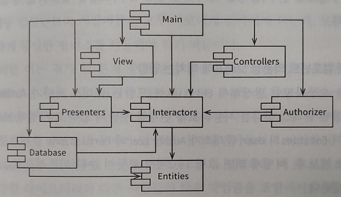

# 컴포넌트 결합

컴포넌트 사이의 관계를 설명하는 세 가지 원칙이 존재한다. 이 원칙들은 개발 가능성과 논리적 설계 사이의 균형을 다룬다.

## ADP(Acyclic Dependencies Principle, 의존성 비순환 원칙)

컴포넌트 의존성 그래프에 순환(cycle)이 있어서는 안 된다는 원칙이다. 

### 숙취 증후군

열심히 개발해서 동작하도록 만든 결과물이 다음날 출근해서 보면 제대로 동작하지 않는 경우가 있는데, 이는 누군가가 내가 작성한 소스코드가 의존하고 있던 무언가를 수정했기 떄문이다. 이 문제는 규모가 큰 프로젝트와 개발팀으로 구성된 경우에 더 크고 무서운 문제로 발생한다. 
여기서는 이 문제를 숙취 증후군이라 명명하기로 하며, 이 문제를 해결하기 위한 두 가지 방법이 발전되어 왔는데 그것은 주 단위 빌드와 의존성 비순환 원칙이다.

### 주 단위 빌드

중간 규모의 프로젝트에서 흔하게 사용되며, 일주일의 첫 4일 동안 각자 개발하고 금요일에 코드를 통합하여 빌드하는 방법이다. 하지만 이 방법은 프로젝트가 커지면서 통합이 금요일 하루만에 끝마치는게 불가능해 질 수 있다는 단점이 있다. 
즉, 프로젝트가 커짐에 따라 통합에 드는 시간이 하루가 아닌 이틀이 될 수 있고, 점점 개발이 아닌 빌드를 하는데에 더 시간을 쏟게 될 수 있다는 것이다. 그렇게 빌드 일정은 늘어나면서 통합과 테스트를 하기가 점점 힘들어지게 된다.

### 순환 의존성 제거하기

개발 환경을 릴리스 가능한 컴포넌트 단위로 분리하는 방법으로 컴포넌트는 개별 개발자나 단일 개발팀이 책임질 수 있는 작업 단위가 된다. 컴포넌트를 새로 릴리스하면 해당 컴포넌트를 사용중인 다른 팀에서는 새 릴리스를 당장 적용하거나, 그렇지 않다면 적용할 준비가 되었다는 판단이 들었을 때 릴리스를 사용할 수 있다. 
이렇게되면 어떤 팀도 다른 팀에 의해 좌우되지 않으며, 특정 컴포넌트가 변경되도 다른 팀에 즉각 영향을 주지 않는다.
또한 통합은 작고 점진적으로 이뤄지며 특정 시점에 모두 모여 통합하는 일은 사라진다. 
물론 이 방법은 성공하려면 컴포넌트 사이의 의존성 주고를 반드시 관리해야 하며, 의존성 구조에 순환이 있어서는 안 된다.

#### 비순환 컴포넌트 구조의 예

* 비순환 방향 그래프.
    * 어느 컴포넌트에서 시작하더라도, 의존성 관계를 따라가면서 최초의 컴포넌트로 되돌아갈 수 없음.
* 변경에 영향 받는 컴포넌트의 통합.
    * Presenters가 새로 릴리스되면 View와 Main 컴포넌트가 영향을 받음.
    * View, Main 컴포넌트 개발자는 새로운 릴리스를 언제 통합시킬지 반드시 결정해야 함.
* 테스트와 빌드의 변수 최소화.
    * Presenters 테스트 시, 현재 사용중인 버전의 Interactors와 Entities를 이용해서 Presenters 자체 버전을 빌드.
    * 빌드 과정에 시스템의 나머지 컴포넌트는 전혀 관련이 없음.
* 시스템 전체 릴리스시 상향식으로 진행.
    * 진행 절차
        1. 먼저 Entities 컴포넌트를 컴파일, 테스트, 릴리스 진행.
        1. Database와 Interactors를 진행.
        1. Presenters, View, Controllers, Authorizer순으로 진행.
        1. Main은 마지막으로 처리.
    * 구성요소 간 의존성을 파악하고있으면 시스템을 빌드하는 방법을 알 수 있음.

