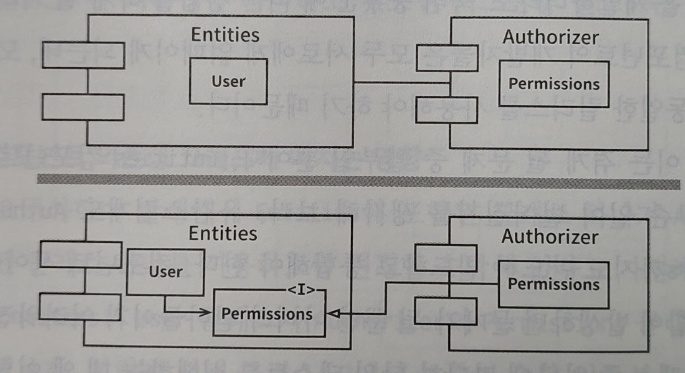

# ADP(Acyclic Dependencies Principle, 의존성 비순환 원칙)

컴포넌트 의존성 그래프에 순환(cycle)이 있어서는 안 된다는 원칙이다. 

개발 환경은 릴리스 가능한 컴포넌트 단위로 분리되고 개별 개발자나 단일 개발팀이 책임질 수 있는 작업 단위로 만들며, 당연하게도 컴포넌트 사이의 의존성 구조에 순환이 있어서는 안 된다. 
컴포넌트를 새로 릴리스하면 해당 컴포넌트를 사용중인 다른 팀에서는 새 릴리스를 당장 적용하거나, 그렇지 않다면 적용할 준비가 되었다는 판단이 들었을 때 릴리스를 사용할 수 있다. 
이렇게되면 어떤 팀도 다른 팀에 의해 좌우되지 않으며, 특정 컴포넌트가 변경되도 다른 팀에 즉각 영향을 주지 않는다.
또한 통합은 작고 점진적으로 이뤄지며 특정 시점에 모두 모여 통합하는 일은 사라진다.

## 비순환 컴포넌트 구조의 예

* 비순환 방향 그래프.
    * 어느 컴포넌트에서 시작하더라도, 의존성 관계를 따라가면서 최초의 컴포넌트로 되돌아갈 수 없음.
* 컴포넌트 변경시 통합 일정에 대한 결정 필요.
    * Presenters가 새로 릴리스되면 View와 Main 컴포넌트가 영향을 받음.
    * View, Main 컴포넌트 개발자는 새로운 릴리스를 언제 통합시킬지 반드시 결정해야 함.
* 테스트와 빌드의 변수 최소화.
    * Presenters 테스트 시, 현재 사용중인 버전의 Interactors와 Entities를 이용해서 Presenters 자체 버전을 빌드.
    * 빌드 과정에 시스템의 나머지 컴포넌트는 전혀 관련이 없음.
* 시스템 전체 릴리스시 상향식으로 진행.
    * 진행 절차
        1. 먼저 Entities 컴포넌트를 컴파일, 테스트, 릴리스 진행.
        1. Database와 Interactors를 진행.
        1. Presenters, View, Controllers, Authorizer순으로 진행.
        1. Main은 마지막으로 처리.
    * 구성요소 간 의존성을 파악하고 있으면 시스템을 빌드하는 방법을 알 수 있음.

## 순환 컴포넌트의 악영향

### 예제

Entities의 User 클래스가 Authorizer의 Permissions 클래스를 사용한다고 하면, 순환 의존성이 발생한다.

이 순환 구조로 인해 Entities, Authorizer, Interactors는 하나의 거대한 컴포넌트가 되어버렸다. 이 컴포넌트의 개발자들은 서로에게 얽매이게 되며, 모두 항상 정확하게 동일한 릴리스를 사용해야 한다. 

#### 테스트시의 문제

Entities 컴포넌트를 테스트 시, Authorizer와 Interactors까지도 반드시 빌드하고 통합해야 한다. 이처럼 순환 구조시에 컴포넌트를 분리하기가 상당히 힘들어진다.

#### 빌드 순서

어떤 순서로 빌드해야 올바를지 파악하기가 힘들어진다. 올바른 순서라는 것 자체가 없을 수도 있다.

## 순환 끊기

### 1. 의존성 역전 원칙(DIP) 적용

User가 필요로 하는 메서드를 제공하는 인터페이스를 생성하고 Authorizer에서 이 인터페이스를 구현하도록 한다.

### 2. 새로운 컴포넌트 생성

Entities와 Authorizer가 모두 의존하는 새로운 컴포넌트를 만든다. 하지만 요구사항이 변경되면 컴포넌트 구조도 변경될 수 있기 때문에 의존성 구조에 순환이 발생하는지를 항상 관찰해야 한다.

## 하향식 설계

컴포넌트 구조는 하향식으로 설계될 수 없다. 컴포넌트는 시스템에서 가장 먼저 설계할 수 없으며, 시스템이 성장하고 변경될 때 함께 진화한다. 
그 이유로 컴포넌트 의존성 다이어그램은 애플리케이션의 기능을 기술하는 일과 전혀 관련이 없고, 애플리케이션의 빌드 가능성과 유지보수성을 보여주는 지도와 같으므로 프로젝트 초기에 설계할 수 없기 때문이다. 
애플리케이션이 계속 성장함에 따라 재사용 가능한 요소를 만드는데 관심을 기울이기 시작할 것이고, 컴포넌트를 조합하는 과정에서 CRP나 ADP를 적용하며 컴포넌트 의존성 그래프는 변경되고 성장할 것이다. 
그래서 아직 아무런 클래스도 설계하지 않은 상태에서 컴포넌트 의존성 구조를 설계하려고 시도한다면 실패할 가능성이 크다. 따라서 컴포넌트 의존성 구조는 시스템의 논리적 설계에 발맞춰 성장하며 진화해야 한다.

