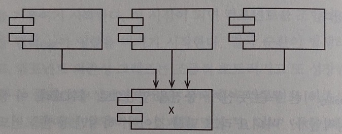
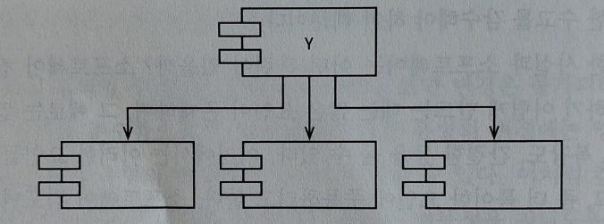
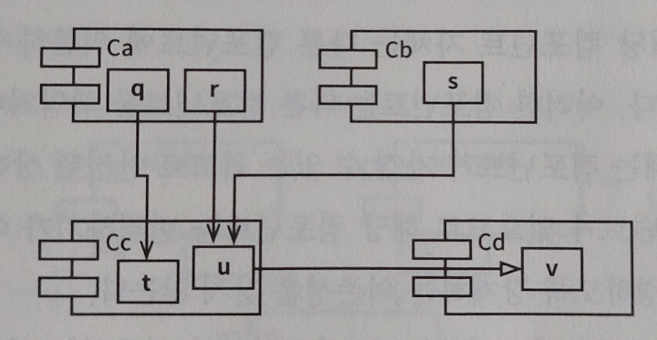
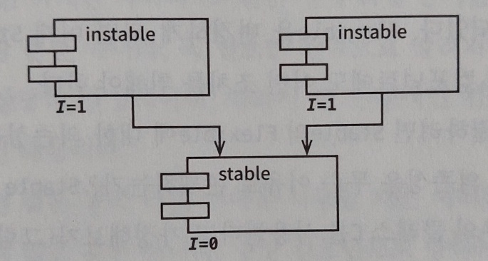
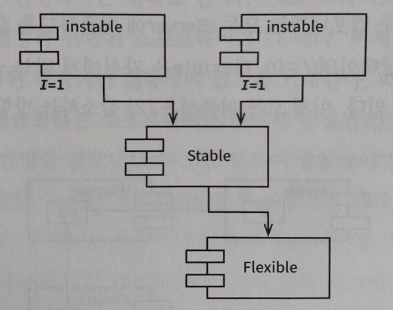
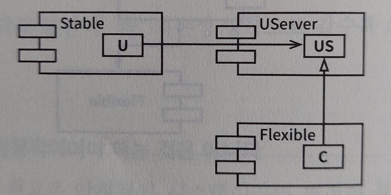

# SDP(Stable Dependencies Principle, 안정된 의존성 원칙)

컴포넌트는 더 안정된 쪽으로 의존해야 한다는 원칙이다. 

설계를 하다보면 변경은 불가피하기 때문에 컴포넌트 중 일부는 변동성을 지니도록 설계한다. 그러나 변동성이 큰 모듈에 누군가가 의존성을 매달아버리면 이 모듈은 더 이상 변경하기가 어려워진다. 따라서 변경하기 어려운 모듈이 변경하기 쉽게 만들어진 모듈에 의존하지 않도록 만들어야 한다.

## 안정성

'안정성'이란 말은 사전에서 '쉽게 움직이지 않는'이라고 정의한다. 소프트웨어 컴포넌트 입장에서는 쉽게 변경되지 않는 상태란 것인데, 컴포넌트를 쉽게 변경하기 어렵게 만드는 요인은 크기, 복잡도, 간결함 등이 있지만 좀 더 확실한 방법은 수많은 다른 컴포넌트가 해당 컴포넌트에 의존하는 것이다. 그 이유는 사소한 변경이라도 의존하는 모든 컴포넌트를 만족시키면서 변경하기가 어렵기 때문이다.

### 안정된 컴포넌트 예

* X는 세 컴포넌트가 의존하고 있어서 변경하지 말아야 할 이유가 세 가지가 됨. (세 컴포넌트를 책임짐)
* X는 어디에도 의존하지 않으므로 X가 변경되도록 만들 수 있는 외적인 영향이 없음.

### 불안정한 컴포넌트 예

* Y는 세 개의 컴포넌트에 의존하므로 변경이 발생할 수 있는 외부 요인이 세 가지. (의존적)
* Y에 어떤 컴포넌트도 의존하지 않으므로 Y는 책임성이 없음.

## 안정성 지표

안정성 지표는 컴포넌트로 들어오고 나가는 의존성의 개수로 측정할 수 있다.

* Fan-in : 안으로 들어오는 의존성. 
    * 해당 컴포넌트에 의존하는 다른 컴포넌트 클래스 개수.
* Fan-out : 바깥으로 나가는 의존성. 
    * 해당 컴포넌트가 다른 컴포넌트에 의존하는 클래스 개수.
* I (불안정성) : I = Fan-out / (Fan-in + Fan-out).
    * I=0이면 최고로 안정된 컴포넌트, I=1이면 최고로 불안정한 컴포넌트.

### 예제

* Cc의 Fan-in = 3.
* Cc의 Fan-out = 1.
* Cc의 안정성 지표 I = 1/4.

### I=1의 의미

I 값이 1이면 어떤 컴포넌트도 해당 컴포넌트에 의존하지 않지만(Fan-in = 0), 해당 컴포넌트는 다른 컴포넌트에 의존한다(Fan-out > 0)라는 의미이다. 그리고 자신에게 의존하는 컴포넌트가 없으므로 변경하지 말아야 할 이유가 없고, 다른 컴포넌트에 의존하므로 언젠가는 변경해야 할 이유가 생길 수 있다.

### I=0의 의미

해당 컴포넌트에 의존하는 다른 컴포넌트가 있지만(Fan-in > 0), 해당 컴포넌트 자체는 다른 컴포넌트에 의존하지 않는다(Fan-out = 0)라는 의미이다. 다른 컴포넌트를 책임지며 독립적이기 때문에 최고로 안정된 상태이다. 자신에게 의존하는 컴포넌트가 있어서 변경하기 어렵지만, 변경하도록 강제하는 의존성은 갖지 않는다.

### 의존성 지표의 의미

해당 컴포넌트가 의존하는 다른 컴포넌트들의 I보다 커야 한다는 것을 의미한다. 즉, 의존성 방향으로 갈수록 I 지표 값이 감소해야 한다.

## 모든 컴포넌트가 안정적일 순 없다

모든 컴포넌트가 최고로 안정적인 시스템은 변경이 불가능하며 바람직한 구조가 아니다. 즉, 컴포넌트 구조에는 불안정한 것도 있고 안정된 것도 존재한다. 

### 이상적인 구조의 예

* 위쪽에 변경이 가능한 컴포넌트가 아래의 안정된 컴포넌트에 의존.
* 다이어그램은 불안정한 컴포넌트를 관례적으로 위쪽에 둠.
    * 위로 향하는 화살표가 있으면 SDP를 위배하는 상태가 됨.

### SDP 위배의 예

* Flexible은 변경이 쉽도록 설계한 컴포넌트로 불안정한 상태이길 기대함.
* Stable 컴포넌트에서 Flexible에 의존성을 걸게되어서 Flexible의 I 지표는 안정성을 나타냄.
* Flexible는 변경이 어렵게 되었고, 변경하기 위해서는 Stable과 Stable에서 의존하는 컴포넌트를 챙겨야 함.

#### 문제 해결

* DIP를 도입해서 의존성을 역전 시킴.
* 두 컴포넌트가 UServer에 의존하도록 만듦.
* Userver은 안정된 상태이며(I=0), Flexible은 자신에게 맞는 불안정성(I=1)을 유지할 수 있음.
* 추상 컴포넌트의 사용.
    * 오로지 인터페이스만을 포함하는 컴포넌트를 생성하는 방식.
    * 추상 컴포넌트는 상당히 안정적이며, 덜 안정적인 컴포넌트가 의존할 수 있는 이상적인 대상.