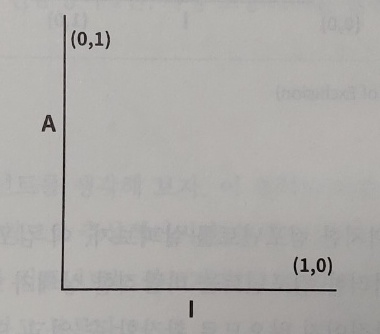
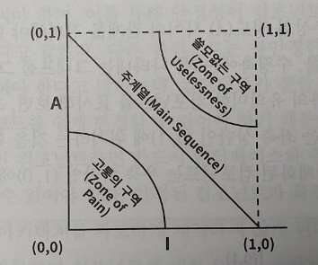
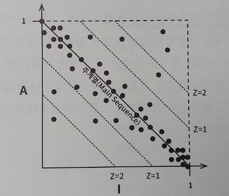
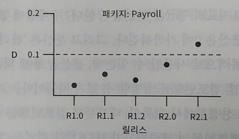

# SAP(Stable Abstractions Principle, 안정된 추상화 원칙)

컴포넌트는 안정된 정도만큼만 추상화되어야 한다는 원칙으로 안정성과 추상화 정도 사이의 관계를 정의한다.

## 고수준 정책을 위한 추상 클래스

고수준 아키텍처나 정책 결정과 관련된 소프트웨어는 자주 변경해서는 안 된다. 그래서 고수준 정책을 캡슐화하는 소프트웨어는 반드시 안정된 컴포넌트(I=0)에 위치해야 한다. 
하지만 이 정책을 포함하는 컴포넌트는 소스 코드를 수정하기가 어려워지고, 시스템 전체 아키텍처가 유연성을 잃게 된다. 컴포넌트가 최고로 안정된 상태이면서도 변경에 충분히 대응할 수 있을 정도의 유연성을 갖추는 방법은 OCP 원칙에서 찾을 수 있는데, 이 원칙을 준수하는 클래스가 바로 추상 클래스이다.

## 안정된 컴포넌트 = 추상 컴포넌트

SAP 원칙은 한편으로 안정된 컴포넌트는 추상 컴포넌트여야 하며, 안정성이 컴포넌트를 확장하는 일을 방해해서는 안 된다고 말한다. 따라서 안정적인 컴포넌트는 반드시 인터페이스나 추상 클래스로 구성되어 쉽게 확장할 수 있어야 한다. 
SAP와 SDP를 결합하면 컴포넌트에 대한 DIP나 마찬가지가 되는데, SDP는 의존성이 반드시 안정성의 방향으로 향해야 한다고 말하고, SAP는 안정성이 추상화를 의미한다고 말하기 떄문이다. 즉, 의존성은 추상화의 방향으로 향하게 된다.
 
하지만 DIP는 클래스에 대한 원칙으로, 클래스는 추상적이거나 아니거나 둘 중 하나이지만, SDP와 SAP의 조합은 컴포넌트에 대한 원칙이며, 컴포넌트는 어떤 부분은 추상적이면서 다른 부분은 안정적일 수 있다. 

## 추상화 정도 측정

* Nc : 컴포넌트의 클래스 개수
* Na : 컴포넌트의 추상 클래스와 인터페이스 개수
* A: Na / Nc (추상화 정도). 
    * 0과 1 사이의 값.
    * 0이면 컴포넌트에는 추상 클래스가 하나도 없음.
    * 1이면 추상 클래스만을 포함.

## 안정성과 추상화 정도를 나타내는 그래프 (A/I 그래프)

* 안정성과 추상화 정도 사이의 관계를 나타내는 그래프.
* 최고로 안정적이며 추상회된 컴포넌트는 좌측 상단 (0,1)에 위치.
* 최고로 불안정하며 구체화된 컴포넌트는 우측 하단 (1,0)에 위치.

## 주계열과 배제구역

* A/I 그래프에서 배제 구역과 주계열을 표시하는 그래프.

컴포넌트는 추상화와 안정화의 정도가 다양하기 때문에 양 끝단의 두 지점에만 존재할 수 없다. 그러나 위치해서는 안 되는 영역(배제 구역)은 존재한다. 그리고 합리적인 지점을 정의하는 점의 궤적(주계열)이 있으리라고도 가정할 수 있다.

### 고통의 구역

(0,0) 주변에 위치한 컴포넌트는 매우 안정적이며 구체적이다. 그래서 확장할 수 없고 변경하기도 상당히 어렵기 때문에 배제해야 할 구역이다. 그러나 변동성이 없는 컴포넌트라면 고통의 구역에 위치해도 크게 문제될게 없다.
변동성이 없고 구체적인 클래스만 모여있는 컴포넌트의 예로는 String 컴포넌트가 있다.

### 쓸모없는 구역

(1,1) 주변에 위치한 컴포넌트는 최고로 추상적이지만, 누구도 해당 컴포넌트에 의존하지 않는다.

## 배제구역 벗어나기 (주계열에 위치시키기)

변동성이 큰 컴포넌트 대부분은 두 배제 구역으로부터 가능한 한 멀리 떨어뜨려야 한다. 그렇게 되면 (1,0)과 (0,1)을 잇는 점의 궤적을 그리게 되며, 이 선분을 주계열이라 부른다. 
여기 위치한 컴포넌트는 자신의 안정성에 비해 너무 추상적이지도, 추상화 정도에 비해 너무 불안정하지도 않다. 즉, 추상화된 수준에 어울릴 정도로만 다른 컴포넌트가 의존하며, 구체화된 수준에 어울릴 정도로만 다른 컴포넌트에 의존한다.

## 주계열과의 거리 (D 지표)

컴포넌트가 얼마나 이상적인 상태로부터 멀리 떨어져 있는지 측정하는 지표를 구할 수 있다. 

* D: 거리. D = A + I - 1.
* D가 0이면 컴포넌트가 주계열 바로 위에 위치.
* D가 1이면 주계열로부터 가장 멀리 위치.

### D 지표의 활용

D 지표의 평균과 분산을 구해서 설계를 통계적으로 분석할 수 있다. 만약 주계열에 일치하도록 설계되었다면 평균과 분산은 0에 가까워진다. 그리고 분산은 관리 한계를 결정하는 목적으로도 사용될 수 있다. 분산을 통해 다른 컴포넌트에 비해 극히 예외적인 컴포넌트를 식별할 수 있기 때문이다.

### D 지표 활용의 예 1 (표준편차)

D 지표의 평균과 분산으로 표준편차를 구할 수 있는데, 이 표준편차를 벗어나는 컴포넌트를 있는지 확인하고 검토해볼 수 있게 된다. 이런 컴포넌트는 의존하는 컴포넌트가 거의 없지만 너무 추상적이거나 의존하는 컴포넌트가 많지만 너무 구체적일 것이다. 
위 그림에서 대부분의 컴포넌트는 주계열을 따라 위치하지만 일부 컴포넌트는 표준편차가 1(Z=1)인 영역을 벗어나 있다.

### D 지표 활용의 예 2 (시간에 따른 D 지표)

각 컴포넌트의 D 값을 시간에 따라 그려볼 수 있다. 그림에서 관리 한계인 0.1을 초과하고 있는 R2.1은 확인이 필요하다.

## 결론

여기서 설명한 의존성 관리 지표는 설계의 의존성과 추상화 정도가 내가 훌륭한 패턴이라고 생각하는 수준에 얼마나 잘 부합하는지를 측정한다. 그러나 지표는 참고용이지 완벽하지 않음을 잊지 말아야 한다.