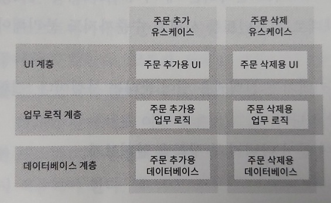

# 독립성

## 좋은 아키텍처

"1. 아키텍처"에서도 나왔지만 좋은 아키텍처는 특정 요소들을 지원해야 한다.

### 1. 유스케이스

아키텍처는 시스템의 의도를 드러내야 하는데, 만약 시스템이 장바구니 애플리케이션이라면 장바구니와 관련된 유스케이스를 지원해야 한다. 그러나 아키텍처는 시스템의 행위에 영향을 주지 않는다. 하지만 행위를 명확히 하고 외부로 드러내어 시스템이 지닌 의도를 아키텍처 수준에서 알 수 있게 해야한다. 
그러기 위해 클래스와 함수 또는 모듈이 핵심적인 자리를 차지하고 있고, 자신의 기능을 분명하게 하는 이름을 가져야 한다. 그리고 이를 통해 유스케이스는 시스템 구조에서 한눈에 드러날 것이다.

### 2. 운영

만약 시스템이 초당 100,000명의 고객을 처리하거나, 수 밀리초 안에 3차원의 빅데이터 테이블에 질의해야 한다면, 이런 운영 작업을 허용할 수 있는 형태로 아키텍처를 구조화해야 한다. 
그래서 시스템은 여러 형태의 구조(모노리틱, 마이크로서비스 등)로 구성되어지는데, 뛰어난 아키텍트라면 이런 시스템 형태의 결정사항을 열어두어야 한다. 만약 시스템이 모노리틱 구조라면 다중 프로세스, 다중 스레드 또는 마이크로서비스 형태가 필요해질 때 개선하기 어렵다. 
그러나 컴포넌트를 적절히 격리하고 컴포넌트 간 통신 방식을 특정 형태로 제한하지 않는다면, 요구사항이 바뀌어도 시스템 형태를 전환하는 일이 훨씬 쉬워질 것이다.

### 3. 개발

아키텍처는 개발환경을 지원하는데 핵심적인 역할을 수행한다. 만약 많은 팀으로 구성 어떤 시스템을 개발한다면, 각 팀이 독립적으로 행동하기 편한 아키텍처를 확보하여 개발하는 동안 팀들이 서로를 방해하지 않도록 해야 한다. 그러기 위해서는 컴포넌트 단위로 시스템을 분할하여 독립적으로 작업할 수 있어야 한다.

### 4. 선택사항 열어놓기

좋은 아키텍처는 위 관심사 사이에서 균형을 맞추고 각 관심사 모두를 만족시킨다. 하지만 모든 유스케이스, 운영에 필요한 제약사항, 팀 구조, 배포 요구사항을 알지 못하며 안다 하더라도 시간이 지날수록 이 사항들은 변해간다. 
그러나 그 중에서도 아키텍처 원칙은 변하지 않으며, 이 원칙들은 시스템을 컴포넌트 단위로 분할하는데 도움을 주며, 이를 통해 선택사항을 가능한 오랫동안 열어 둘 수 있게 해준다. 그럼으로써 향후 시스템의 변경에 쉽게 대응할 수 있게 된다.

## 결합 분리

아키텍트는 시스템의 기본적인 의도가 무엇인지 알고(장바구니 시스템인지 주문 처리 시스템인지) SRP와 CCP를 적용해서 다른 이유로 변경되는 것들은 분리하고, 동일한 이유로 변경되는 것들은 묶는다.

### 1. 계층 결합 분리

서로 다른 이유로 변경되는 것들의 예로 UI와 업무 규칙, 데이터베이스가 있다. 이 요소들은 서로에게 아무런 관련이 없으며 각자 다른 속도, 다른 이유로 변경된다. 그리고 이렇게 함으로써 각 요소를 독립적으로 변경할 수 있으며, 이를 통해 시스템을 서로 결합되지 않은 수평적인 계층으로 분리할 수 있게 된다.

### 2. 유스케이스 결합 분리

다른 이유로 변경되는 것에는 유스케이스 그 자체가 있다. 주문 입력 시스템에서 주문을 추가하는 유스케이스와 주문을 삭제하는 유스케이스는 서로 다른 속도로, 다른 이유로 변경 된다. 그리고 유스케이스는 시스템의 수평적인 계층을 가로지르는 수직의 조각이기도 하다. 각 유스케이스는 UI의 일부, 업무 규칙의 일부, 데이터베이스 기능의 일부를 사용하기 때문이다. 
이렇게 시스템에서 서로 다른 이유로 변경되는 요소들의 결합을 분리하면 기존 요소에 지장을 주지 않고 새로운 유스케이스를 계속해서 추가할 수 있게 된다.

