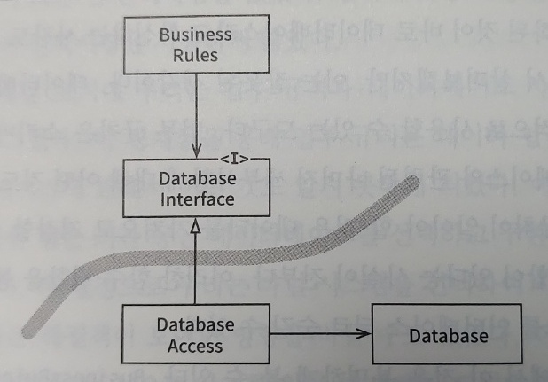
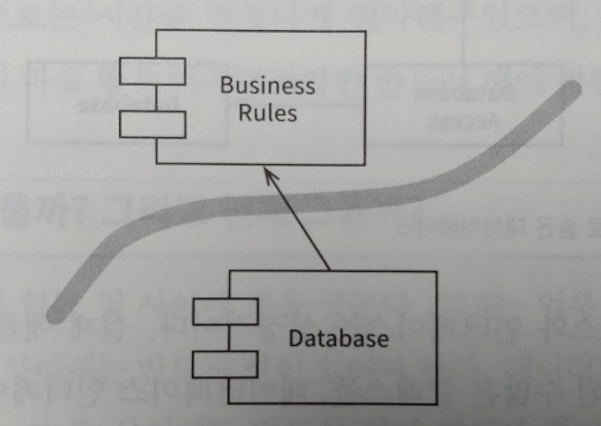
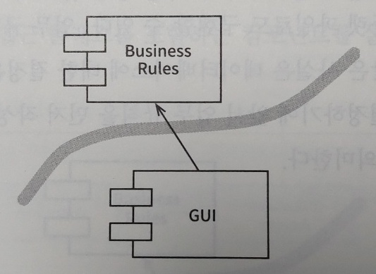
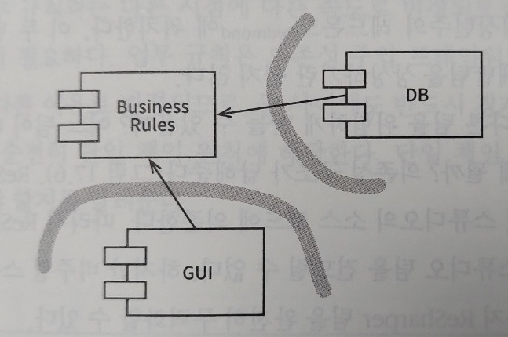

# 경계

소프트웨어 아키텍처는 **경계**라는 **선을 긋는 기술**이다. 이 경계는 소프트웨어 요소를 분리하고, 경계 반대편에 있는 요소들이 서로 알지 못하도록 막는다.

### 궁극적인 목적 : 결합의 방지

* 아키텍트의 목표는 시스템을 만들고 유지하는데 드는 **인적 자원을 최소화**하는 것.
* 인적 자원의 효율을 떨어뜨리는 주요 요인은 바로 **너무 일찍 내려진 결정에 따른 결합**.
    * 유스케이스와 관련이 없는 결정들 (프레임워크, DB, 웹 서버, 유틸리리 라이브러리 등).
* 결국 이른 결정에 따른 결합을 방지해서 결정들에 의존하지 않고 결정을 연기할 수 있는 좋은 아키텍처를 추구.
    * 핵심적인 업무 로직을 오염시키지 못하게 만듦.

## 경계를 구분하는 방법

선은 관련이 있는 것과 없는 것 사이에 그어야 한다.

### 예시 1 : 데이터베이스와 업무 규칙

* 데이터베이스는 업무 규칙이 간접적으로 사용할 수 있는 도구일 뿐임.
* 업무 규칙은 데이터베이스와 관련된 세부사항에 대해 어떤 것도 알아서는 안 됨.
* 업무 규칙은 단순히 데이터를 가져오고 저장할 수 있는 함수 집합 있다는 사실만 알면 됨.

#### 클래스 수준의 관점

* 위 그림에서 업무 규칙은 DatabaseInterface를 사용해서 데이터를 로드하고 저장.
* 인터페이스를 구현하는 DatabaseAccess가 데이터베이스를 실제로 조작.
* 경계선은 DatabaseInterface 아래에 그어짐.
* DatabaseAccess에서 출발하는 화살표의 대상들은 DatabaseAccess가 존재한다는 사실을 알지 못함.

#### 컴포넌트 수준의 관점

* DB는 BusinessRules을 알고 있지만, BusinessRules는 DB 알지 못함.
    * BusinessRules에게 있어 DB는 문제가 되지 않지만, DB는 BusinessRules 없이 존재할 수 없음.
* 두 컴포넌트 사이에 화살표의 방향이 BusinessRules로 향하기 떄문에 BusinessRules는 어떤 종류의 데이터베이스도 사용할 수 있음.
* 궁극적으로 DB에 대한 결정은 연기할 수 있으며, 업무 규칙을 먼저 작성하고 테스트하는데 집중 가능.

### 예시 2 : GUI와 업무 규칙

* 시스템에 있어서 입력과 출력은 사실 중요하지 않음.
* 입출력 인터페이스의 뒤에는 인터페이스를 조작하는 모델(데이터 구조와 함수로 구성된 정교한 집합)이 존재.

* GUI 컴포넌트가 BusinessRules 컴포넌트를 신경 쓰고 있는 구조.
* GUI는 다른 종류의 인터페이스로 얼마든지 교체 가능.

## 플러그인 아키텍처

소프트웨어 개발 기술의 역사는 플러그인을 손쉽게 생성하여, 확장 가능하며 유지보수가 쉬운 시스템 아키텍처를 확립할 수 있게 만드는 방법에 대한 이야기이다. 
선택적이거나 수많은 다양한 형태로 구현될 수 있는 나머지 컴포넌트로부터 핵심적인 업무 규칙은 분리되어 있고, 독립적이어야 한다.

### 업무규칙에 플러그인 형태로 연결된 DB와 GUI

* 수많은 종류의 사용자 인터페이스를 플러그인 형태로 연결 가능.
    * 웹 기반, 클라이언트/서버 기반, SOA나 콘솔 기반 등등.
* 데이터베이스도 어떠한 종류의 데이터베이스 기술로 대체 가능.

## 플러그인에 대한 논의

* 플러그인 아키텍처는 변경이 전파될 수 없는 방화벽을 생성 가능.
    * 시스템에서 한 부분이 변경되더라도 관련 없는 나머지 부분이 망가지길 원치 않음.
* 경계는 변경의 축이 있는 지점에 그어짐.
    * 경계의 한쪽에 위치한 컴포넌트는 반대편의 컴포넌트와 다른 속도로, 다른 이유로 변경됨.
* 결국 선을 긋는다는 것은 단일 책인 원칙을 지키는 것이며, SRP는 어디에 경계를 그어야 할지를 알려줌.

## 결론

소프트웨어 아키텍처에서 경계선을 그리려면 먼저 시스템을 컨포넌트 단위로 분할해야 한다. 그리고 핵심 업무 규칙에 해당하는 컴포넌트와 나머지 플러그인으로 배치할 컴포넌트를 구분짓는다. 마지막으로 컴포넌트 사이의 화살표가 핵심 업무를 향하도록 컴포넌트의 소스를 배치하도록 한다.  
이것은 의존성 역전 원칙과 안정된 추상화 원칙을 응용한 것이며 의존성 화살표는 저수준 세부사항에서 고수준 추상화를 향하도록 배치된다.
