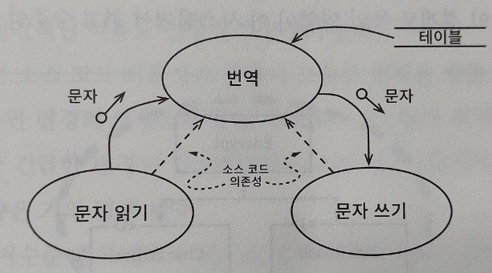
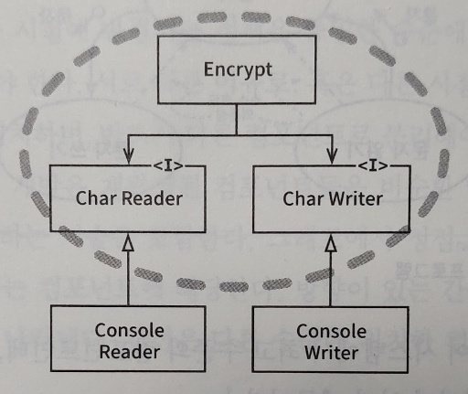
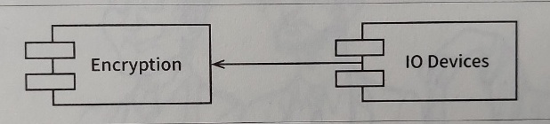

# 정책

소프트웨어 시스템이란 **정책을 기술한 것**으로, 컴퓨터 프로그램은 각 입력을 출력으로 변환하는 정책을 상세하게 기술한 설명서이다. 하나의 정책은 이 정책을 서술하는 여러 개의 조그만 정책들로 쪼갤 수 있다.

## 정책의 예

* 집계와 관련된 업무 규칙을 처리하는 방식을 서술하는 정책.
* 특정 보고서를 어떤 포맷으로 만들지 서술하는 정책.
* 입력 데이터를 어떻게 검증할지 서술하는 정책.

## 정책 편성

소프트웨어 아키텍처에는 정책을 신중하게 분리하고, 정책의 변경에 따라 정책을 재편성하는 것도 중요하다.

* 동일한 이유로 동일한 시점에 변경되는 정책은 동일한 수준에 위치, 동일한 컴포넌트에 속해야 함.
* 서로 다른 이유나 시점에 변경되는 정책은 다른 수준에 위치, 다른 컴포넌트로 분리.

## 컴포넌트 편성

재편성된 컴포넌트들은 비순환 방향 그래프로 구성되어야 한다.

### 그래프의 구성요소

1. 정점(node) : 동일한 수준의 정책을 포함하는 컴포넌트.
2. 방향이 있는 간선(edge) : 컴포넌트 사이의 의존성.
    * 간선은 다른 수준에 위치한 컴포넌트를 서로 연결.

### 컴포넌트 의존성

* 의존성은 소스 코드, 컴파일타임의 의존성.
    * 자바 import, C# using, 루비 require 구문.
* 좋은 아키텍처는 의존성의 방향이 컴포넌트의 수준을 기반으로 만들어짐.
* 저수준의 컴포넌트가 고수준의 컴포넌트에 의존하도록 설계.

 

# 수준

수준을 엄밀하게 정의하자면 **입력과 출력까지의 거리**이다. 

* 입력과 출력으로부터 멀리 위치할수록 정책의 수준이 높음.
* 입력과 출력을 다루는 정책은 시스템의 최하위 수준.

## 예시 (암호화 프로그램, 컴포넌트)

아래 그림은 간단한 암호화 프로그램으로 문자를 입력받아 테이블을 참조하여 번역하고 출력한다.

* 데이터 흐름은 굽은 실선 화살표로 표시.
* 소스 코드 의존성은 곧은 점선으로 표시.

### 가장 높은 수준의 컴포넌트

* 번역 컴포넌트는 최고 수준의 컴포넌트로 입력과 출력에서 가장 멀리 떨어져 있다.

### 소스 코드 의존성 방향

* 데이터 흐름과 소스 코드 의존성이 같은 방향을 가리키지 않음.
    * 소스 코드 의존성은 그 수준에 따라 결합.
    * 데이터 흐름을 기준으로 결합되면 안 됨.

## 예시 (암호화 프로그램, 클래스)

### 경계

* Encrypt 클래스, CharWriter와 CharReader 인터페이스를 둘러싸고 있는 경계.
* 이 경계를 횡단하는 의존성은 모두 경계 안쪽으로 향함.
* 경계 안의 영역은 이 시스템에서 최고 수준의 구성요소.

### 저수준의 입력 출력 클래스

* ConsoleReader와 ConsoleWriter는 입력과 출력에 가까운 저수준이다.
* 고수준의 암호화 정책을 저수준의 입력/출력 정책으로부터 분리.
* 입력과 출력에 변화가 생기더라도 암호화 정책은 영향 받지 않음.

## 정리

* 고수준 정책은 저수준 정책보다 덜 빈번하게 변경되고, 보다 중요한 이유로 변경.
* 저수준의 입력과 출력에 가까이 위치한 정책은 더 빈번하게 변경되고, 보다 긴급성을 요하며, 덜 중요한 이유로 변경.
* 모든 소스 코드의 의존성 방향이 고수준 정책을 향할 수 있도록 정책을 분리해서 변경의 영향도를 줄여야 함.

### 플러그인

* 저수준 컴포넌트가 고수준 컴포넌트에 플러그인 되어야함을 의미하기도 함.

