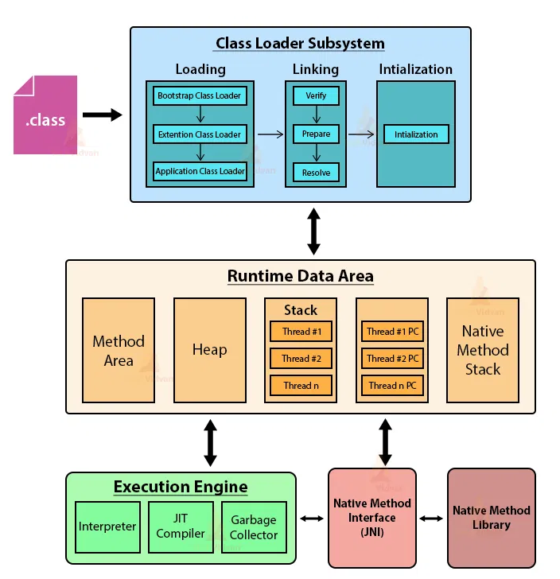

# JVM 구조



## 클래스 로더

* .class 파일의 바이트 코드를 읽어들여서 메모리에 적절하게 배치하는 역할을 담당.
* 로딩 -> 링크 -> 초기화 순으로 진행.

### Loading : 클래스를 읽어오는 과정

* 클래스 파일을 읽고 그 내용에 따라 바이너리 데이터를 만들어 메소드 영역에 저장.
    * 메소드 영역에 저장하는 데이터
        * 풀 패키지 이름을 포함한 클래스 이름 (FQCN, Fully Qualified Class Name)
        * 클래스, 인터페이스, 이늄 여부
        * 메소드와 변수
* 로딩이 끝나면 해당 클래스 타입의 Class 객체가 Heap 영역에 저장됨.
    * MyClass라는 클래스를 정의하면 소스상에서 MyClass.class로 class 객체(Class&lt;MyClass&gt;)에 접근할 수 있음.
* 각 단계별 로더
    1. Bootstrap Class Loader : jre의 lib폴더에 있는 rt.jar 파일을 찾아 자바 기본 클래스들을 로드.
    2. Platform(구 Extension) Class Loader : jre의 lib폴더에 있는 ext 폴더에 위치한 확장 코어 클래스 파일들을 로드.
    3. Application Class Loader : 사용자가 직접 정의한 클래스 파일들을 로드. Classpath 환경변수에 있는 클래스 파일이나 -classpath 또는 -cp 명령어 옵션이 있는 파일들을 로드.


### Linking(연결)

* Verify(검증), Prepare(준비), Resolve(optional) 세 단계로 나뉨.
* 검증 단계 : .class 파일 형식이 유효한지 체크. 임의로 class 파일을 조작하면 에러 발생.
* 준비 단계 : 클래스 변수(static 변수)와 기본값에 필요한 메모리 준비.
* 해석 단계 : 심볼릭 메모리 레퍼런스를 메소드 영역에 있는 실제 레퍼런스로 교체. (optional로 Linking에서 이 작업이 실행될수도 있고 실제 레퍼런스를 사용할 때 실행될 수 있음)

#### 심볼릭 메모리 레퍼런스 (명확하게 정의되지 않은 레퍼런스)

```java
MyClass myClass = new MyClass();
```

* 위의 코드를 읽었다 하더라도 myClass는 실제 heap 영역의 레퍼런스를 가리키고 있지 않음.
* 힙 영역의 실제 레퍼런스를 가리키도록 하는 작업을 Linking 과정의 Resolve 단계에서 발생하거나(optional) 실제 사용될 때 발생.

### 초기화

* static 변수의 값 할당.
* static 블럭이 있다면 이때 실행됨.
