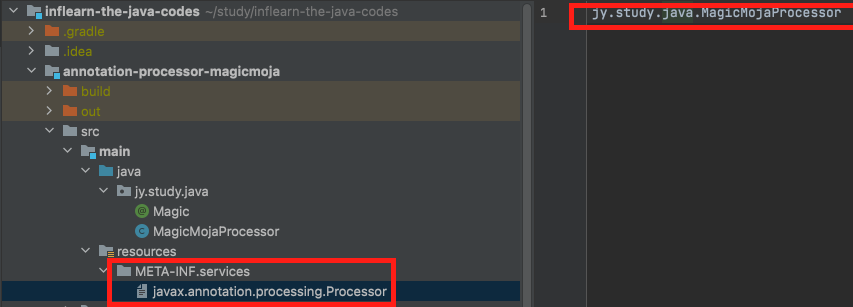
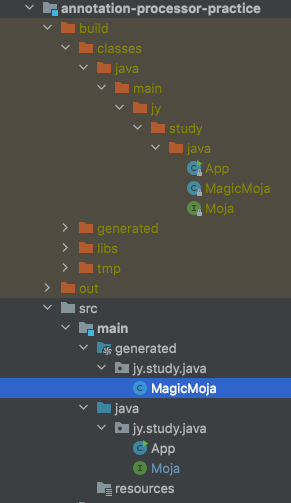

# 실습 내용

* PullOut이라는 메서드를 정의한 Moja라는 인터페이스에 Magic이라는 애노테이션을 적용.
* Magic 애노테이션이 붙은 Moja 인터페이스를 찾아서 MagicMoja라는 구현 클래스를 생성하는 애노테이션 프로세서를 생성.
* 빌드 단계에서 해당 애노테이션 프로세서가 실행된 후 MagicMoja 클래스가 생성되서 사용.
* 애노테이션 프로세서와 해당 프로세서를 사용하는 프로젝트를 각각 별도로 생성.

## 1. Magic 애노테이션 생성

```java
// 인터페이스, 클래스, Enum 지정 가능.
@Target(ElementType.TYPE)
//컴파일 타임에 쓰고 바이트코드에는 필요없기 때문에 소스코드까지만 유지.
@Retention(RetentionPolicy.SOURCE)
public @interface Magic {
}
```

## 2. 애노테이션 프로세서 생성

* [Processor](https://docs.oracle.com/javase/8/docs/api/javax/annotation/processing/Processor.html) API를 사용.
* Processor 인터페이스를 사용해도 되지만 자바가 제공하는 기본적인 추상 클래스인 AbstractProcessor를 사용.
* [Javapoet](https://github.com/square/javapoet) 라는 자바 소스 코드 생성 라이브러리를 사용.


### gradle 디펜던시 추가

```groovy
dependencies {
    implementation 'com.squareup:javapoet:1.13.0'
}
```

### 애노테이션 프로세서 동작 코드

```java
public class MagicMojaProcessor extends AbstractProcessor {

    //이 프로세서가 어떤 애노테이션을 처리할 것인지 오버라이딩
    @Override
    public Set<String> getSupportedAnnotationTypes() {
        //이 프로세서가 처리할 애노테이션 이름 문자열로 전달 (Maigc 애노테이션 처리)
        return Set.of(Magic.class.getName());
    }

    @Override
    public boolean process(Set<? extends TypeElement> annotations, RoundEnvironment roundEnv) {
        //Magic 애노테이션이 붙은 엘리먼트들 조회
        //엘리먼트는 소스코드의 구성요소로 패키지, 인터페이스, 클래스, 메서드, 필드 등을 지칭
        Set<? extends Element> elements = roundEnv.getElementsAnnotatedWith(Magic.class);

        for (Element element : elements) {
            Name simpleName = element.getSimpleName();

            //엘리먼트의 타입을 조회해서 인터페이스가 아니면 컴파일이 되지 않도록 에러 처리
            if (element.getKind() != ElementKind.INTERFACE) {
                processingEnv.getMessager().printMessage(Diagnostic.Kind.ERROR,
                        "Magic annotation can not be used on " + simpleName);
            } else {
                processingEnv.getMessager().printMessage(Diagnostic.Kind.NOTE, "Processing " + simpleName);
            }

            
            TypeElement typeElement = (TypeElement) element;
            //엘리먼트의 클래스 정보 조회
            ClassName className = ClassName.get(typeElement);

            //메서드 생성
            MethodSpec pullOut = MethodSpec.methodBuilder("pullOut")
                    //접근제어자
                    .addModifiers(Modifier.PUBLIC)
                    //return 타입
                    .returns(String.class)
                    //소스코드 내용
                    .addStatement("return $S", "Rabbit!")
                    .build();

            //클래스 생성
            TypeSpec magicMoja = TypeSpec.classBuilder("MagicMoja")
                    //public class
                    .addModifiers(Modifier.PUBLIC)
                    //Magic 애노테이션이 붙어있는 인터페이스 구현
                    .addSuperinterface(className)
                    //위에서 생성한 메서드 pullOut 적용
                    .addMethod(pullOut)
                    .build();


            //소스코드, 클래스코드, 리소스를 생성할 수 있는 인터페이스
            Filer filer = processingEnv.getFiler();

            try {
                //애노테이션이 적용된 해당 엘리먼트(Moja 인터페이스)와 같은 패키지에 MagicMoja 클래스 생성
                JavaFile.builder(className.packageName(), magicMoja)
                        .build()
                        //filer에 소스코드 생성
                        .writeTo(filer);
            } catch (IOException e) {
                processingEnv.getMessager().printMessage(Diagnostic.Kind.ERROR, "FATAL ERROR: " + e);
            }
        }

        //true 반환시 라운드 재시작하지 않음.
        return true;
    }
}

```

## 3. 애노테이션 프로세서 등록



* resources에 META-IN/services 생성.
* Processor 인터페이스 패키지 이름인 javax.annotation.processing.Processor의 파일 생성.
* 생성한 프로로세서의 풀패키지 클래스이름을 저장.

## 4. 빌드 및 로컬 메이븐 저장소에 등록

* gradle 기준

```groovy
apply plugin: 'maven-publish'

publishing {
    publications {
        myPublicationName(MavenPublication) {
            groupId = 'jy.study.java'
            artifactId = 'annotation-processor-magicmoja'
            version = '0.1'

            from components.java
        }
    }
}

...
```

* gradle publishToMavenLocal 명령어로 빌드 후 로컬 메이븐 저장소에 등록.

## 5. 애노테이션 프로세서 jar 디펜던시 등록

```groovy
dependencies {
    //컴파일 시점에 사용하기위해 의존성 추가
    compileOnly 'jy.study.java:annotation-processor-magicmoja:0.1'
    //애노테이션 프로세서임을 명시
    annotationProcessor 'jy.study.java:annotation-processor-magicmoja:0.1'
}
```

## 6. Magic 인터페이스 생성

```java
@Magic
public interface Moja {
    String pullOut();
}
```

## 7. 빌드

* 먼저 빌드를 하고나면 애노테이션 프로세서에 의해 MagicMoja가 생성됨.



## 8. 사용

```java
public static void main(String[] args) {
    Moja moja = new MagicMoja();
    System.out.println(moja.pullOut());
}
```