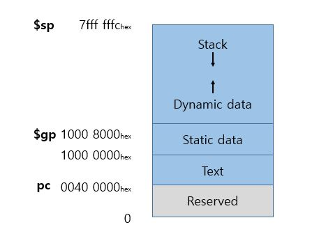

# 컴퓨터 구조

## MIPS 메모리 할당

### 스택

* 스택 포인터는 최상위 주소에서부터 시작해서 아래로 자람.
* 7fff fffc(hex)로 초기화된 후 데이터 세그먼트 쪽으로 자람.

### 동적 데이터 세그먼트

* C의 malloc, Java의 new를 통해 하당되는 동적 데이터가 들어감.
* 힙 영역이라고도 하며, 스택을 향해 위로 자람.

### 정적 데이터 세그먼트

* 상수와 기타 정적 변수들이 들어감.
* 1000 0000(hex) 번지부터 시작됨.
* 전역 포인터($gp)는 데이터를 쉽게 접근 가능하도록 1000 8000(hex)로 초기화.
    * 1000 0000(hex) ~ 1000 ffff(hex) 까지 접근 가능.

### 텍스트 세그먼트

* MIPS 기계어 코드(프로그램 코드인 텍스트)가 들어가는 부분.
* 0040 0000(hex) 번지부터 시작됨.

## MIPS에서 인수가 4개보다 많다면?

* MIPS에서는 나머지 인수를 프레임 포인터 바로 위 스택에 넣음.
* 처음 4개의 인수는 레지스터에 있고, 나머지는 프레임 포인터를 통해 접근가능한 메모리에 있다고 여김.
