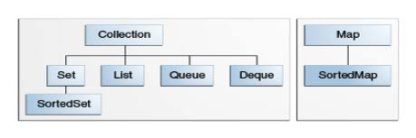

# 배운 내용

## 자바 - 컬렉션 - 핵심 컬렉션 인터페이스

핵심 컬렉션 인터페이스에는 다양한 유형의 컬렉션이 존재하는데, 크게 Collection과 Map으로 나눌 수 있다. 그리고 이 2개의 루트 컬렉션 인터페이스를 기반으로 하부에 여러 컬렉션이 계층을 이루며 존재한다.

* Set은 Collection 인터페이스의 특수한 유형이고, SortedSet은 Set의 특수한 유형.

### 1. Collection

Collection 계층의 최상위 루트 인터페이스이다. 여러 하위 컬렉션들이 갖춰야 할 기능에 대해 추상화를 해놓은 것이기 때문에 가장 추상화되고 공통적인 방법으로 컬렉션을 다룰 수 있다.

이 인터페이스를 직접 구현하는 구현체는 없으며 여러 하위 컬렉션 인터페이스가 좀 더 세부적으로 구현하고 있다. Collection 타입으로 사용했던 적은 없었지만, 사용한다면 하위의 컬렉션들마다 데이터 중복, 순서 등을 다루는 방식이 달라서 사용시에 조심해야할 것 같다.

### 2. Set

중복 요소를 허용하지 않는 컬렉션이다. 수학의 집합을 추상화해놓은 컬렉션이라고 할 수 있다.

### 3. List

중복 요소를 허용하고, 순서도 보장하는 컬렉션이다. 순서를 보장하기 때문에 위치값(index)를 이용해서 List를 제어할 수 있다. 즉, 삽입되는 위치나 검색하고자 하는 위치, 삭제하려고 하는 위치 등을 index로 제어 가능하다.

### 4. Queue

어떤 작업을 처리하기 전에 요소를 보유하는 용도로 사용하는 컬렉션이다. 일반적인 자료 구조의 Queue처럼 FIFO 방식으로 동작하는 큐도 있지만, 특정 Comparator에 의해서 우선 순위를 정렬하는 우선 순위 큐도 존재한다.

### 5. Deque

데크도 큐처럼 처리 전의 요소를 보유하는 용도로 사용하는 컬렉션이다. 하지만 양쪽 끝에서 삽입, 추출이 가능한 차이가 있다. 자료 구조의 Deque를 구현하는 컬렉션이라고 할 수 있다.

### 6. Map

키와 값을 매핑해서 저장하는 컬렉션으로, 키는 중복을 허용하지 않지만 값은 중복을 허용한다. 그래서 각 키에는 하나의 값만 매핑할 수 있다.

### 7. SortedSet, SortedMap

Set과 Map의 정렬된 버전이라고 할 수 있다. 오름차 순으로 정렬한다. Set은 정렬된 단어를 떠올릴 수 있을것이고, Map은 정렬된 알파벳 순서로 정리된 영단어 사전을 떠올릴 수 있을 것이다.

 

# 회고

## 좋았던 점

자바의 컬렉션 인터페이스를 보면서, 컬렉션에는 크게 List, Set, Map 3가지만 존재하는 줄 알았다. 그런데 Queue나 Deque까지 핵심 컬렉션 인터페이스로 포함하고 있는줄은 처음 알았다. 좀 더 확실하게 자바의 핵심 내용들에 대해서 알고싶어서 자바의 공식 문서에서 내용들을 찾아보고 있는데, 올바른 결정이었던 것 같다. 앞으로도 자바의 기본적인 내용들을 공식 문서에서 하나하나 다시 짚어가면서 확인해봐야겠다.

## 아쉬운 점

자바의 공식 문서에서 자바의 기본적이고 핵심적인 내용들을 확인해보면서 진작 이런 시간을 가질걸 그랬다는 생각을 하게 되었다. 그동안 2차 창작물인 책으로만 공부했었고, 기본적인 내용들에 대해 다 알고 있다고 생각했었는데 착각이었던것 같다. 자동차를 잘 운전하는것과 잘 아는것은 다른것과 같은데, 일반인이면 상관없지만 레이서라면 차의 내부 구조나 동작 구조를 이해하고 있어야 어떤 상황에서 어떤식으로 차를 조작해야 더 효율적인지 알고 있을것이다. 나도 자바를 다루고있는 개발자인만큼 자바의 여러가지 내용들에 대해 제대로 알고 사용해야겠다.

