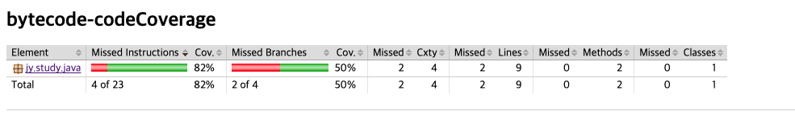
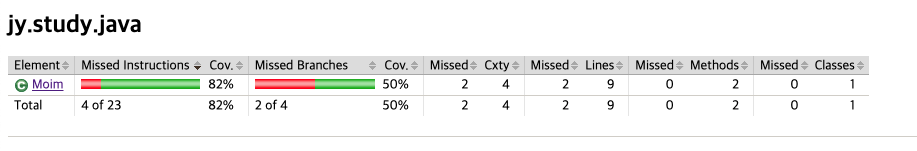
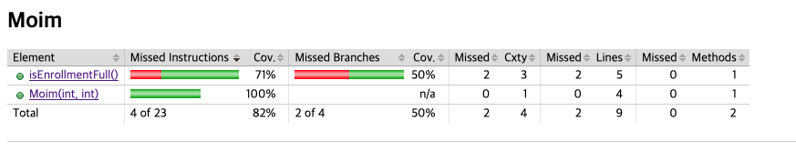
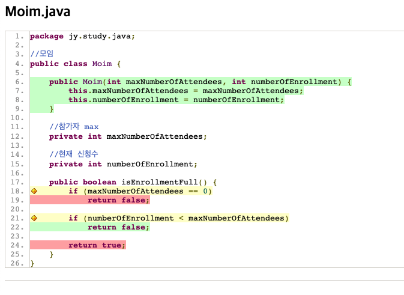

# 코드 커버리지

* 바이트코드를 조작/생성/수정하는 대표적인 예로 코드 커버리지 툴이 있음.
* 코드 커버리지란 테스트가 얼마만큼 충분한지에 대한 지표를 나타냄.

## 코드 커버리지 측정 동작 원리

* 바이트 코드를 읽어서 코드 커버리지를 챙겨야 하는 부분을 체크함.
* 코드가 실행될 때 어느 코드를 지나갔고 지나가지 않았는지 확인.
* 테스트 코드 커버리지 툴은 결국 바이트 코드 조작과 관련이 있음.

## JACOCO (코드커버리지 툴)

### GRADLE 기준으로 설정

```java
plugins {
    id 'jacoco'
}

jacoco {
    toolVersion = "0.8.7"
}

test {
    finalizedBy jacocoTestReport // report is always generated after tests run
}

jacocoTestReport {
    reports {
        xml.required = false
        csv.required = false
        html.outputLocation = layout.buildDirectory.dir('jacocoHtml')
    }
    dependsOn test // tests are required to run before generating the report
}
```

### 테스트 및 report 생성

#### 1. 리포트 생성

```
./gradlew test
```

위 태스크를 실행하면 JUnit으로 작성한 테스트를 실행하고 코드 커버리지 리포트를 만들어 줌.


index.html로 리포트를 생성.


#### 2. 리포트 확인



첫 리포트 페이지 진입 시, 패키지와 그 패키지의 코드 커버리지를 확인 가능.<br/>
82% 커버리지 되었지만, 브랜치(테스트 종류)는 50%밖에 테스트되지 않음.

<br/>



첫 페이지에서 패키지를 클릭하면 클래스의 코드 커버리지를 확인.

<br/>



클래스를 타고 들어가면 어떤 메서드의 커버리지가 부족한지 확인 가능.

<br/>



메소드를 타고 들어가면 코드에서 어떤 부분의 테스트가 부족한지 확인할 수 있는데, 노란색 다이아몬드 표시는 분기문에서 일부분만 테스트 되었다는 것.<br/>
if(maxNumberOfAttendees == 0) 분기문에서 false의 경우를 타는 테스트를 작성하지 않았고,<br/>
if(numberOfEnrollment < maxNumberOfAttendees) 에서 true를 타는 테스트를 작성하지 않음.<br/>


## 코드 커버리지 퍼센트를 통과 못할 시 빌드 실패 설정

### gradle

```java
jacocoTestCoverageVerification {
    violationRules {
        rule {
            element = 'PACKAGE' //패키지 기준
            limit {
                counter = 'LINE' 
                value = 'COVEREDRATIO'
                minimum = 0.9 // 90퍼센트를 넘지 못하면 빌드 실패
            }
        }
    }
}
```

### 빌드 실패 메시지

